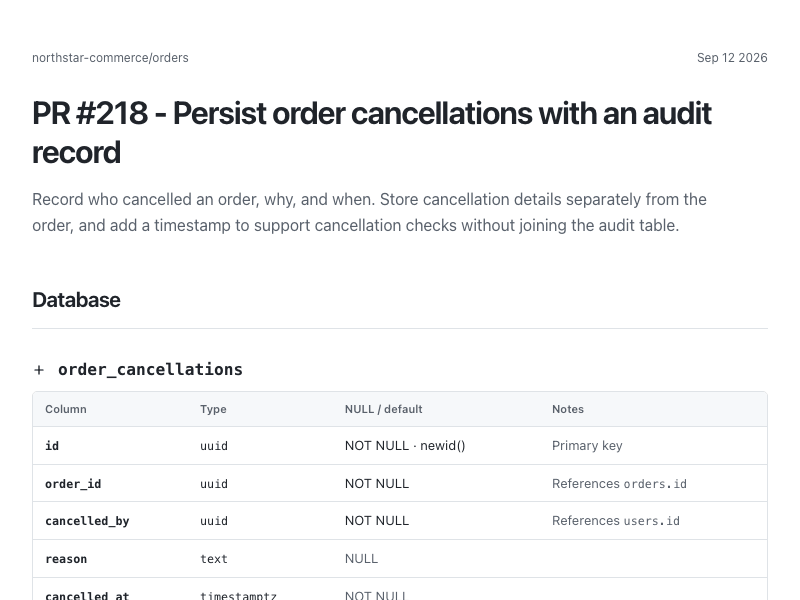

# Bishoymly's Skills

[](https://skills.sh/bishoymly/skills)

Small, focused agent skills for making technical work easier to understand and use.

## Skills

### show-me

Create a clean, human-readable HTML briefing from a technical plan, specification, ticket, pull request, diff, or file. It turns long technical material into a glanceable overview with only the sections that matter—such as database, API, UI, infrastructure, tasks, tests, or progress.

The report is written as a standalone HTML file in the OS temporary directory and opened for review when possible.

**Install:**

```sh
npx skills add bishoymly/skills --skill show-me
```



**Try it:** Ask your agent, “Show me `docs/billing-grace-period.md` in a format the product team can skim.” Show Me turns the file into a short HTML briefing with the relevant changes, progress, and source links. It includes details only when the file supports them.

Other requests:

- “Show me this implementation plan before I approve it.”
- “Show me PR #482 in a format I can skim.”
- “Turn `docs/billing-grace-period.md` into a briefing for the product team.”

## Design principles

- Human-readable first: concise plain English, strong visual hierarchy, and source links for detail.
- Source-agnostic: works with files, tickets, specifications, pull requests, and diffs from any accessible system.
- Adaptive: include relevant sections and invent a better section when the familiar patterns do not fit.
- Grounded: do not invent implementation details, tests, progress, or rollout plans absent from the source.
- Portable: a static HTML artifact with Tailwind and Lucide loaded from CDNs; no build step or runtime dependency.

## Contributing and releases

See [CONTRIBUTING.md](./CONTRIBUTING.md). New skills are top-level directories containing a `SKILL.md` and any directly referenced assets.

## Inspiration

`show-me` is inspired by Humanlayer's [show-me skill](https://github.com/humanlayer/skills/tree/main/plugins/show-me/skills/show-me) and Matt Pocock's [HTML report guidance](https://github.com/mattpocock/skills/blob/main/skills/engineering/improve-codebase-architecture/HTML-REPORT.md). This implementation is an original, specialized skill for technical briefings.

Released under the [MIT License](./LICENSE).
